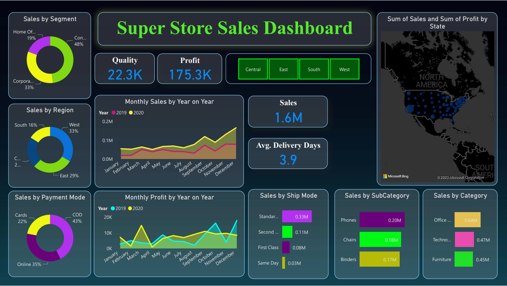

# Power BI Super Store Sales Data Analytics

## Introduction

The Power BI Super Store Sales Data Analytics project is a comprehensive data visualization and forecasting endeavor designed to provide actionable insights into the sales performance of a retail store. By harnessing the capabilities of Microsoft Power BI, this project aims to empower decision-makers with valuable information about historical sales trends and equip them with a reliable 15-day sales forecast.

## Project Goals: 
1.	*Sales Visualization:* The primary objective of this project is to create a visually engaging dashboard that offers a comprehensive overview of the store's sales performance. The dashboard will leverage interactive charts, graphs, and maps to present data from various angles, enabling users to understand sales trends, patterns, and anomalies quickly.
2.	*Historical Analysis:* Through historical sales data analysis, the project will identify key trends, seasonal fluctuations, and growth patterns in the store's sales. By utilizing Power BI's capabilities, the project will unveil insights that help stakeholders understand the factors influencing sales performance over time.
3.	*Forecasting:* One of the central features of the project is to develop an accurate 15-day sales forecast. By employing advanced forecasting techniques, the project aims to provide stakeholders with a reliable prediction of future sales, enabling better inventory management, resource allocation, and strategic planning.
4.	*Interactive User Experience:* The Power BI dashboard will be designed to provide an interactive and user-friendly experience. Users will be able to filter and drill down into data using slicers and filters, allowing them to focus on specific time periods, product categories, or regions for a more detailed analysis.
5.	*Data-Driven Decision-Making:* The project's ultimate goal is to equip decision-makers with the tools they need to make informed choices based on data insights. By presenting information in a clear and accessible manner, the project will empower stakeholders to optimize operations, marketing strategies, and resource allocation.

## Key Components:
📌 *Sales Overview:* An initial overview section will provide high-level insights into total sales, average order value, and sales by product category. This will give users a quick snapshot of the store's performance.

📌	*Sales Trend Analysis:* A series of line charts and bar graphs will visualize historical sales trends, allowing users to identify patterns, spikes, and dips in sales over specific time periods.

📌	*Geographical Analysis:* Maps and geographical visualizations will display sales distribution across different regions, helping users understand where the store's products are most popular.

📌	*Forecasting Model:* The heart of the project, this section will showcase the methodology used for forecasting, including the algorithm and parameters. The 15-day sales forecast will be presented alongside historical sales data for comparison.

📌	*Drill-Down Capability:* Users can drill down into specific categories, products, or time frames to gain deeper insights into the factors driving sales performance.

## Benefits:

📌	*Informed Strategy:* Stakeholders can make strategic decisions based on historical trends and future predictions, enhancing the store's competitive edge.

📌	*Efficient Inventory Management:* Accurate forecasting assists in optimizing inventory levels, reducing carrying costs, and preventing stockouts.

📌	*Resource Allocation:* Insights from the project guide allocation of resources, such as staff and marketing efforts, for maximum impact.

📌	*Quick Response:* By identifying sales anomalies in real-time, the store can quickly respond to emerging trends or issues.

📌	*Improved Customer Experience:* Data-driven insights enable tailoring products and promotions to customer preferences, enhancing satisfaction.

## Output:

## Conclusion:
 
 #### This Power BI Super Store Sales Data Analytics project merges advanced data visualization and forecasting techniques to provide a comprehensive platform for analyzing historical sales data and predicting future sales trends. By doing so, it empowers decision-makers with actionable insights that drive informed strategic choices and enable the store to thrive in a dynamic market environment.

